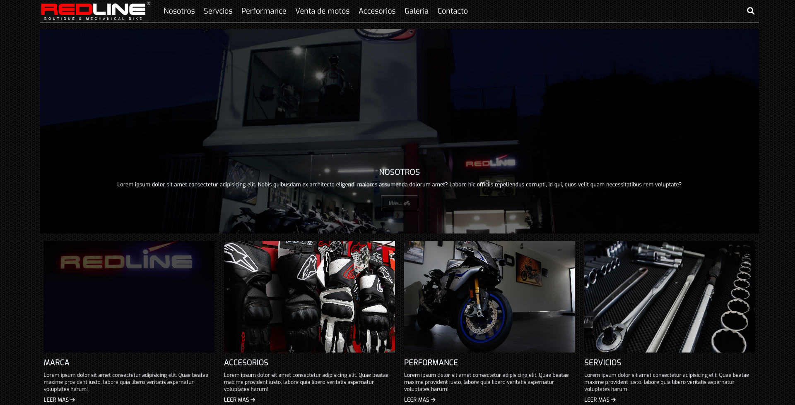

# redline
reestructura de pagina web redline mexico usando su contenido y combinando con imagenes de www.pexels.com

# recursos
### https://www.pexels.com
### https://www.heropatterns.com/
### https://fontawesome.com
### https://es.siteground.com

## extras
reducir el peso de las imagines bg
generar un favicon partiendo de logo 1 2 o 3
integrar googlesheets para crear catalogo en whatsapp https://www.youtube.com/watch?v=hyHdW2LwTug

